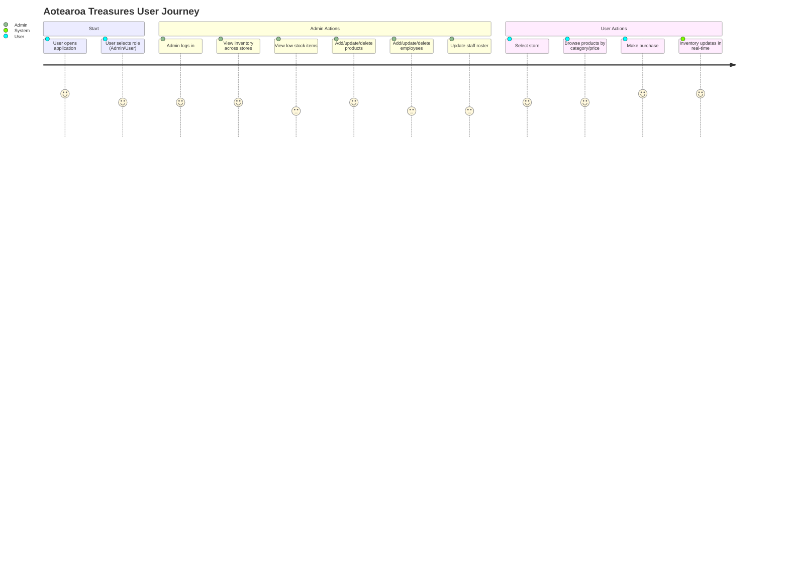

# Aotearoa Treasures Inventory Management System

Aotearoa Treasures Ltd. is a boutique retailer specializing in New Zealand-made handicrafts and souvenirs, with stores in Wellington CBD, Christchurch, and Auckland. This project delivers a centralized inventory management system to streamline operations, optimize staff scheduling, and provide a seamless experience for both administrators and customers.

## Table of Contents

- [Features](#features)
- [User Stories](#user-stories)
- [Project Structure](#project-structure)
- [Getting Started](#getting-started)
- [Usage](#usage)
- [Data Files](#data-files)
- [User Journey](#user-journey)
- [Command Reference](#commands-reference)

---

## Features

- **Centralized Inventory Management**: View and manage inventory levels across all stores in real-time
- **Product Management**: Add, update, and delete products. View products by category and price
- **Low Stock Alerts**: Instantly view items with stock less than five to enable timely reordering
- **Purchasing System**: Users can select a store, browse available products, and make purchases, which update inventory in real-time
- **Staff Roster Management**: Admins can view and edit weekly staff rosters for each store
- **Employee Management**: Add, update, and delete employee records
- **Role-Based Access**: Secure admin login for accessing privileged features
- **CSV-Based Data Storage**: All data is stored in CSV files for portability and ease of editing

---

## User Stories

### Admin
- Add, update, and remove items
- View items with stock less than five for proactive reordering
- Update the weekly staff roster for each store
- Log in securely using a registered admin username
- View inventory levels across all stores

### User
- Select a store (Wellington, Christchurch, or Auckland) to browse inventory
- View products by category and price
- Make purchases from a selected store, updating inventory in real-time

---

## Project Structure

```
ATS/
├── ATS.cpp                # Main file of application
├── employee.cpp/hpp       # Employee records management functions
├── customer.cpp/hpp       # Customer records management functions
├── admin_.cpp/hpp         # Admin records management functions
├── product.cpp/hpp        # Product records management functions
├── commonfunc.cpp/hpp     # Common utility functions (validation, etc.)
├── modcsv.cpp/hpp         # CSV read/write utilities
├── admin_details.csv      # Admin user data
├── employee_details.csv   # Employee records
├── customer_details.csv   # Customer records
├── product_details.csv    # Product records
├── order_details.csv      # Purchase records
├── employee_roster.csv    # Staff rosters
└── help.csv               # Command lines
```

## Getting Started

### Prerequisites

- C++14 compatible compiler (e.g., MSVC, GCC, Clang)
- Visual Studio 2022 for building

### Build Instructions

#### Using Visual Studio:
1. Open the project folder in Visual Studio 2022
2. Build the solution (`Ctrl+Shift+B`)

---

## Usage

- **Admin Login**: Log in with your admin credentials to access inventory and staff management features
- **Product Management**: Add, update, or delete products. View products filtered by category or price
- **Low Stock View**: Instantly see products with less than five items in stock
- **Purchasing**: Users select a store, browse available products, and make purchases. Inventory updates automatically
- **Roster Management**: Admins can view and edit the weekly staff roster for each store
- **Employee Management**: Add, update, or delete employee records

---

## Data Files

| File | Description |
|------|-------------|
| `admin_details.csv` | Admin user data |
| `employee_details.csv` | Employee records |
| `customer_details.csv` | Customer records |
| `product_details.csv` | Product records |
| `order_details.csv` | Purchase records |
| `employee_roster.csv` | Staff rosters |
| `help.csv` | Help and documentation |

---

## User Journey



---

## Commands Reference

The system operates through a command-line interface with the following commands:

### Authentication Commands
| Command | Function |
|---------|-----------|
| `signup` | Create a new customer account |
| `login` | Login as a customer |
| `login admin` | Login as an admin |
| `logout` | Logout from current session |

### Product Management Commands (Admin Only)
| Command | Function |
|---------|-----------|
| `add product` | Add a new product |
| `update product` | Update product details |
| `delete product` | Delete a product |
| `show product` | Show all products |
| `show product category <category name>` | Show products of specific category |
| `show product storeLocation <store location name>` | Show products of specific store location |
| `show product asc price` | Show products in ascending order by price |
| `show product asc quantity` | Show products in ascending order by quantity |
| `show product desc price` | Show products in descending order by price |
| `show product desc quantity` | Show products in descending order by quantity |
| `alert quantity` | Show products with less than 5 quantity remaining |

### Employee Management Commands (Admin Only)
| Command | Function |
|---------|-----------|
| `add employee` | Add a new employee |
| `update employee` | Update employee details |
| `delete employee` | Delete an employee |
| `show employee` | Show all employees |
| `show employee position <position>` | Show employees of specific position |

### Roster Management Commands (Admin Only)
| Command | Function |
|---------|-----------|
| `add roster` | Add a new roster entry |
| `update roster` | Update roster details |
| `delete roster` | Delete a roster entry |
| `show roster` | Show all rosters |

### Customer Commands
| Command | Function |
|---------|-----------|
| `buy <product Id>` | Purchase a product by ID |
| `delete customer` | Delete customer account (Admin only) |

### Utility Commands
| Command | Function |
|---------|-----------|
| `help` | Display list of available commands |

> **Note**: Commands marked as "Admin Only" require admin login to execute.
